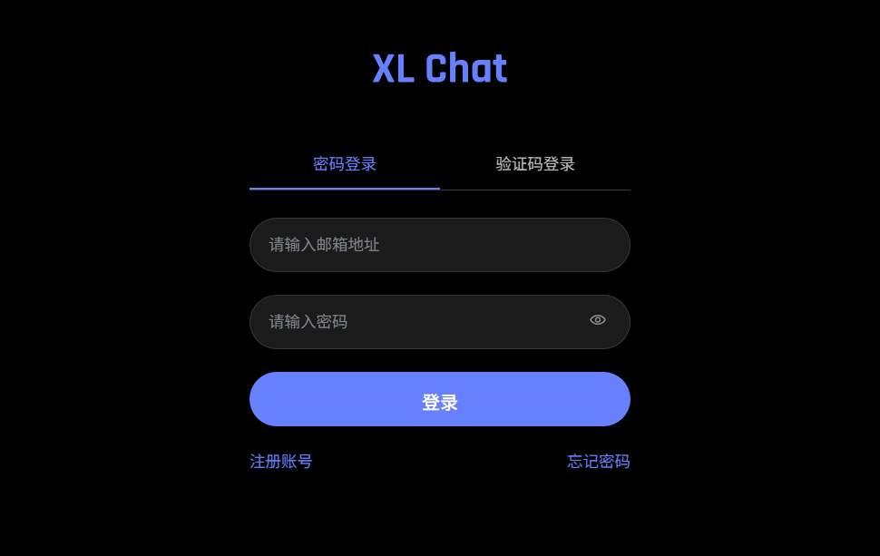

# XL Chat - 鐧诲綍绯荤粺

<p align="center">
  
</p>

<p align="center">
  <strong>鈿狅笍 閲嶈鎻愮ず锛氬綋鍓嶇増鏈负鍗婃垚鍝侊紝浠呭寘鍚櫥褰曟敞鍐屽姛鑳斤紝涓嶅寘鍚亰澶╀富鍔熻兘銆?/strong>
</p>
<p align="center">
  <strong>鏁版嵁搴撲娇鐢⊿QLite锛氳交閲忎絾涓嶆敮鎸侀珮骞跺彂銆佸垎甯冨紡閮ㄧ讲锛屼粎閫傚悎鍗曟満灏忓瀷搴旂敤锛屾棤娉曞簲瀵圭敤鎴烽噺澧為暱</strong>
</p>

## 馃搵 椤圭洰绠€浠?

XL Chat 鏄竴涓幇浠ｅ寲鐨勭敤鎴疯璇佺郴缁燂紝閲囩敤鍓嶅悗绔垎绂绘灦鏋勫疄鐜般€傜洰鍓嶅凡瀹屾垚鐧诲綍銆佹敞鍐屻€佸瘑鐮侀噸缃瓑鏍稿績鍔熻兘锛屽彲浣滀负瀹屾暣鑱婂ぉ绯荤粺鐨勫墠绔叆鍙ｃ€?

**褰撳墠鐗堟湰鐘舵€?*锛氣渽 宸插畬鎴?- 鐢ㄦ埛璁よ瘉绯荤粺锛堝崐鎴愬搧锛?br>
**璁″垝鍔熻兘**锛氣潓 鏈畬鎴?- AI 鑱婂ぉ涓诲姛鑳?

## 馃殌 蹇€熷紑濮?

### 鐜瑕佹眰

- Node.js 16+
- Python 3.6+锛堢敤浜庡惎鍔ㄨ剼鏈級
- npm 鎴?yarn

### 瀹夎姝ラ
```
鍏嬮殕椤圭洰锛坓it clone https://github.com/XL1126/xlchat-login-skeleton.git锛?
 鈫?
瀹夎绗笁鏂瑰簱锛坧ython setup.py锛?
 鈫?
澶嶅埗鍙橀噺鏂囦欢锛坈p .env.example .env锛?
 鈫?
鍒涘缓鑴氭湰锛坧ython launcher.py锛?
 鈫?
杩愯鑴氭湰锛堝畬鎴愶紒锛?

濡傛灉瑕佸紑鍚痟ttps鍗忚鐨勮瘽闇€瑕佸彟澶栭厤缃瘉涔︽枃浠跺埌client/certs涓?
```
#### 1. 瀹夎渚濊禆

鎵ц涓嬮潰鐨刾y鏂囦欢蹇€熷畨瑁?

```bash
# 鎵ц涓€閿畨瑁呰剼鏈?
python setup.py
```
鎴栨墜鍔ㄥ畨瑁?
```bash
# 瀹夎鏍归」鐩緷璧?
npm install

# 瀹夎鍓嶇渚濊禆
cd client
npm install
cd ..
```
---
#### 2. 閰嶇疆鐜鍙橀噺

澶嶅埗 `.env.example` 涓?`.env`锛屽苟鏍规嵁瀹為檯鎯呭喌淇敼锛?

```bash
cp .env.example .env
```

> 鈿狅笍 **閲嶈鎻愮ず**锛歚.env` 鏂囦欢鍖呭惈鏁忔劅淇℃伅锛堥偖绠卞瘑鐮併€丣WT瀵嗛挜绛夛級锛?*璇蜂繚绠″ソ鏂囦欢**銆?

缂栬緫 `.env` 鏂囦欢锛岄厤缃互涓嬪彉閲忥細

```env
# 鏈嶅姟鍣ㄩ厤缃?
PORT=3000                          # 鏈嶅姟鍣ㄧ鍙?
NODE_ENV=development               # 鐜妯″紡锛歞evelopment锛堝紑鍙戯級/ production锛堢敓浜э級

# JWT瀵嗛挜
JWT_SECRET=your-secret-key-here    # 鐢ㄤ簬鍔犲瘑 Token 鐨勫瘑閽ワ紝閮ㄧ讲鏃朵細鑷姩鐢熸垚

# 閭欢閰嶇疆
EMAIL_HOST=smtp.example.com        # SMTP 鏈嶅姟鍣ㄥ湴鍧€锛屽 smtp.qq.com銆乻mtp.gmail.com
EMAIL_PORT=587                     # SMTP 绔彛锛孮Q/缃戞槗閭鐢?587锛孲SL 鐢?465
EMAIL_USER=your-email@example.com  # 鍙戜欢浜洪偖绠?
EMAIL_PASS=your-email-password      # 閭鎺堟潈鐮侊紙闈炵櫥褰曞瘑鐮侊級

# 鍓嶇URL锛堢敤浜庨偖浠朵腑鐨勯摼鎺ワ紝閮ㄧ讲鏃跺繀椤讳慨鏀逛负瀹為檯鍩熷悕锛?
CLIENT_URL=http://localhost:5173   # 閭欢閲屽瘑鐮侀噸缃摼鎺ョ殑鍩熷悕
                                  # 鑷姩澶勭悊鏈熬鏂滄潬锛岄伩鍏嶅弻鏂滄潬闂
                                  # 鏈厤缃椂榛樿浣跨敤 http://localhost/
```
### `.env` 鏂囦欢鏀寔鍔ㄦ€佷慨鏀癸紝鏃犻渶閲嶅惎鏈嶅姟鍣?

---
#### 3. 鍚姩鏈嶅姟

**鏂瑰紡涓€锛氫娇鐢ㄥ惎鍔ㄨ剼鏈紙鎺ㄨ崘锛?*

鏍圭洰褰曚笅鐨刲auncher.py鏂囦欢鏈韩鏄?**鐢熸垚鍚姩鑴氭湰** 鐨勶紝骞朵笉鏄惎鍔ㄨ剼鏈?

```bash
# 鏌ョ湅甯姪
python launcher.py

# 鐢熸垚閫夋嫨鎬у惎鍔ㄨ剼鏈紙Windows锛?
python launcher.py --bat

# 鐢熸垚蹇€熷惎鍔ㄨ剼鏈紙Windows HTTPS锛?
python launcher.py --bat --https

# 鐢熸垚閫夋嫨鎬у惎鍔ㄨ剼鏈紙Linux/Mac锛?
python launcher.py --sh

# 鐢熸垚蹇€熷惎鍔ㄨ剼鏈紙Linux/Mac HTTPS锛?
python launcher.py --sh --https
```

**鏂瑰紡浜岋細鎵嬪姩鍚姩**

```bash
# 寮€鍙戞ā寮忥紙鍚屾椂杩愯鍓嶅悗绔紝HTTP锛?
npm run dev

# 寮€鍙戞ā寮忥紙HTTPS锛?
npm run dev:https

# 浠呰繍琛屽悗绔?
npm run server:dev

# 浠呰繍琛屽墠绔?
npm run client:dev
```
鎵嬪姩鍚姩杩樺彲浠ユ洿澶嶆潅涓€鐐?
```bash
# 寮€鍚悗绔湇鍔?
node server/index.js

# 寮€鍚墠绔湇鍔?
cd client
npm run dev
```
---
### 4. 閰嶇疆 SSL 璇佷功锛堝闇€浣跨敤 HTTPS锛?

濡傛灉浣犻渶瑕佷娇鐢?HTTPS 妯″紡锛岄渶瑕佸噯澶?SSL 璇佷功骞舵斁缃埌 `client/certs/` 鐩綍涓嬶細

```
client/certs/
鈹溾攢鈹€ fullchain.pem     # 璇佷功閾炬枃浠讹紙蹇呭～锛?
鈹斺攢鈹€ privatekey.pem   # 绉侀挜鏂囦欢锛堝繀濉級
```

> 鈿狅笍 **娉ㄦ剰**锛氳瘉涔︽枃浠跺悕蹇呴』浣跨敤 `fullchain.pem` 鍜?`privatekey.pem`杩欙紱涓や釜鍚嶇О锛岄厤缃枃浠朵腑鎸囧畾浜嗕娇鐢ㄥ湪杩欎釜涓や釜鍚嶇О銆?

璇佷功鍑嗗鏂规硶锛?
鍙互鍓嶅線 [杩欎釜](https://github.com/XL1126/xlchat-login-skeleton/tree/main/client/certs) 鐩綍鏌ョ湅濡備綍閰嶇疆璇佷功

---
### 5. 璁块棶搴旂敤

鍚姩鍚庤闂互涓嬪湴鍧€锛?

- **[HTTP](http://localhost:5173) 妯″紡**: http://localhost:5173
- **[HTTPS](https://localhost) 妯″紡**: https://localhost
- **鍚庣 API**: http://localhost:3000

## 馃搧 鍩烘湰椤圭洰缁撴瀯

```
XL-chat/
鈹溾攢鈹€ client/                 # 鍓嶇浠ｇ爜 (React 18 + Vite)
鈹?  鈹溾攢鈹€ certs/               # SSL 璇佷功锛圚TTPS 浣跨敤锛?
鈹?  鈹溾攢鈹€ src/
鈹?  鈹?  鈹溾攢鈹€ components/      # React 缁勪欢
鈹?  鈹?  鈹溾攢鈹€ contexts/       # React Context
鈹?  鈹?  鈹溾攢鈹€ pages/         # 椤甸潰缁勪欢
鈹?  鈹?  鈹溾攢鈹€ App.jsx        # 璺敱閰嶇疆
鈹?  鈹?  鈹斺攢鈹€ App.css        # 鍏ㄥ眬鏍峰紡
鈹?  鈹溾攢鈹€ public/            # 闈欐€佽祫婧?
鈹?  鈹斺攢鈹€ vite.config.js     # Vite 閰嶇疆
鈹溾攢鈹€ server/                # 鍚庣浠ｇ爜 (Express + SQLite)
鈹?  鈹溾攢鈹€ index.js          # 鏈嶅姟鍣ㄥ叆鍙?
鈹?  鈹溾攢鈹€ database.js       # 鏁版嵁搴撻厤缃?
鈹?  鈹斺攢鈹€ mailer.js        # 閭欢鍙戦€佹ā鍧?
鈹溾攢鈹€ database/             # SQLite 鏁版嵁搴撴枃浠讹紙椤圭洰浼氳嚜鍔ㄥ垱寤猴級
鈹溾攢鈹€ launcher.py          # 鍚姩鑴氭湰鐢熸垚鍣?
鈹溾攢鈹€ setup.py             # 蹇€熷畨瑁呯涓夋柟搴?
鈹溾攢鈹€ package.json        # 鏍归」鐩緷璧?
鈹溾攢鈹€ .env                # 鐜鍙橀噺锛堥渶鎵嬪姩鍒涘缓锛?
鈹溾攢鈹€ .env.example        # 鐜鍙橀噺绀轰緥
鈹斺攢鈹€ README.md           # 椤圭洰璇存槑
```

## 鉁?鐜版湁鍔熻兘

- [x] **鐢ㄦ埛娉ㄥ唽** - 閭楠岃瘉鐮佹敞鍐?
- [x] **鐢ㄦ埛鐧诲綍** - 瀵嗙爜鐧诲綍 / 楠岃瘉鐮佺櫥褰?
- [x] **蹇樿瀵嗙爜** - 閭楠岃瘉閲嶇疆瀵嗙爜
- [x] **瀵嗙爜閲嶇疆** - 瀹夊叏閾炬帴閲嶇疆
- [x] **JWT 璁よ瘉** - 鏃犵姸鎬佽韩浠介獙璇?
- [x] **閭欢鍙戦€?* - Nodemailer 閭欢鏈嶅姟
- [x] **鏁版嵁鎸佷箙鍖?* - SQLite 鏁版嵁搴?
- [x] **涓濇粦鍔ㄧ敾** - 270ms 杩涘嚭鍦哄姩鐢?
- [x] **娣辫壊涓婚** - 鐜颁唬 UI 璁捐
- [x] **闃茶嚜鍔ㄥ～鍏?* - 闃叉娴忚鍣ㄨ嚜鍔ㄥ～鍏?

## 馃洜锔?鎶€鏈爤

### 鍚庣

- **Express.js** - Web 妗嗘灦
- **SQLite3** - 杞婚噺绾ф暟鎹簱
- **JWT** - JSON Web Token 璁よ瘉
- **bcrypt** - 瀵嗙爜鍔犲瘑
- **Nodemailer** - 閭欢鍙戦€?

### 鍓嶇

- **React 18** - UI 妗嗘灦
- **React Router 6** - 璺敱绠＄悊
- **Vite** - 鏋勫缓宸ュ叿
- **CSS3** - 鏍峰紡璁捐

## 馃敡 API 鎺ュ彛

| 鏂规硶 | 璺緞 | 鎻忚堪 |
|------|------|------|
| POST | `/api/sign_up` | 鐢ㄦ埛娉ㄥ唽 |
| POST | `/api/sign_in` | 鐢ㄦ埛鐧诲綍 |
| POST | `/api/send_verification_code` | 鍙戦€侀獙璇佺爜 |
| POST | `/api/forgot_password` | 蹇樿瀵嗙爜 |
| POST | `/api/reset_password` | 閲嶇疆瀵嗙爜 |
| POST | `/api/logout` | 鐢ㄦ埛鐧诲嚭 |

## 馃攼 瀹夊叏璇存槑

1. **瀵嗙爜鍔犲瘑**锛氫娇鐢?bcrypt 杩涜瀵嗙爜鍝堝笇
2. **Token 璁よ瘉**锛欽WT 鏃犵姸鎬佽璇?
3. **楠岃瘉鐮?*锛氫竴娆℃€ч獙璇佺爜锛?鍒嗛挓鏈夋晥鏈?
4. **閭欢閾炬帴**锛氶噸缃摼鎺ユ湁鏃舵晥鎬?

## 鈿欙笍 鏈嶅姟鍣ㄩ儴缃叉寚鍗?

1. 瀹夎 Node.js 鍜?Python
2. 鍏嬮殕椤圭洰鍒版湇鍔″櫒
3. 瀹夎渚濊禆
4. 閰嶇疆 `.env` 鏂囦欢
5. 浣跨敤 PM2 鎴栫被浼煎伐鍏风鐞嗚繘绋?
6. 閰嶇疆 Nginx 鍙嶅悜浠ｇ悊锛堝彲閫夛級
7. 閰嶇疆 SSL 璇佷功锛堢敓浜х幆澧冩帹鑽愪娇鐢?HTTPS锛?

### 寮€鍙戜汉鍛?

- **XL1126** - 椤圭洰鍒涘浜?[@XL1126](https://github.com/XL1126)
- **Trae AI** - 澶ч儴鍒嗕唬鐮佺敱 Trae AI 鐢熸垚

### 鑱旂郴鏂瑰紡

- 閭锛歺iaoli201126@qq.com

## 馃搫 璁稿彲璇?

鏈」鐩噰鐢?**MIT 璁稿彲璇?* 杩涜寮€婧愩€?

## 鈿狅笍 鍏朵粬澹版槑

褰撳墠鐗堟湰涓?*鍗婃垚鍝?*锛屼粎瀹炵幇浜嗙敤鎴风櫥褰曟敞鍐屽姛鑳姐€俋L Chat 鐨勬牳蹇冭亰澶╁姛鑳介渶瑕佸紑鍙戣€呰嚜琛屾牴鎹渶姹傝繘琛屽悗缁紑鍙戙€傛湰椤圭洰浠呮彁渚涜璇佺郴缁熺殑鍩虹妗嗘灦锛屼娇鐢ㄨ€呴渶鑷鎵挎媴寮€鍙戝畬鏁村姛鑳界殑璐ｄ换銆?

---


---

## GitHub Pages（介绍站 + 登录 UI 演示）

仓库 `docs/` 目录已启用 GitHub Pages（Settings → Pages · Deploy from branch · `/docs`）：

- 介绍站：https://xl1126.github.io/xlchat-login-skeleton/
- 登录 UI 演示：https://xl1126.github.io/xlchat-login-skeleton/demo/

演示端按 `client/src` 模块 1:1 移植（Animated / Logo / PasswordInput / Toast / AuthContext / pages / App），
样式与 `App.css` 一致，API 文案对照 `server/index.js`。无 Node 时接口由浏览器 localStorage 模拟。
